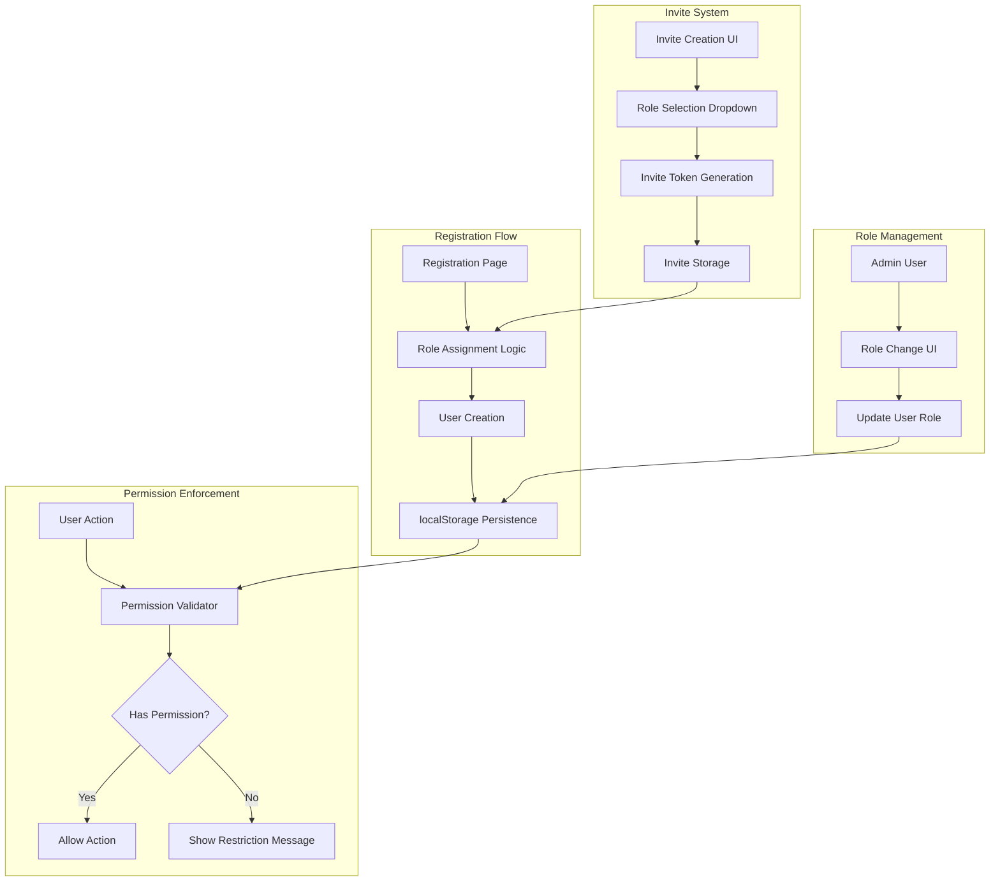

# Design Document: Enhanced Role Assignment System

## Overview

The Enhanced Role Assignment System introduces a sophisticated role-based access control mechanism that differentiates between invited and non-invited users during registration. The system extends the existing authentication and permission infrastructure to support role specification in invites, enforce stricter access controls for Viewer role users, and maintain backward compatibility with the first-user-admin pattern.

### Key Design Goals

1. **Secure Default Access**: Non-invited users receive minimal permissions (Viewer role) by default
2. **Flexible Invitation System**: Invite creators can specify the role for invited users
3. **Backward Compatibility**: Preserve existing admin role management and first-user-admin behavior
4. **Multi-Language Support**: All role-related UI elements support English, Swedish, and Arabic
5. **Data Persistence**: Role assignments persist across sessions using localStorage

### System Context

The system operates within the Amanah family crowdfunding application, which currently uses localStorage for data persistence. The role assignment logic integrates with:
- Authentication system (`src/lib/auth.ts`)
- Permission validation system (`src/lib/permissions.ts`)
- Invite management system (`src/lib/mockData.ts`)
- Registration flow (`src/app/register/page.tsx`)
- Internationalization system (`src/lib/i18n.ts`)

## Architecture

### Component Architecture



### Data Flow

1. **Registration with Invite**:
   - User provides invite token during registration
   - System validates token (exists, not expired, not used)
   - System retrieves role from token metadata
   - System assigns role to new user
   - System marks token as consumed

2. **Registration without Invite**:
   - User registers without invite token
   - System checks if any users exist
   - If no users exist: assign Admin role (first user exception)
   - If users exist: assign Viewer role (default)

3. **Permission Validation**:
   - User attempts action (create campaign, vote, contribute)
   - System retrieves user role from localStorage
   - System checks permission matrix for role
   - System allows or denies action based on permissions

### Role Hierarchy

```
Admin (Unlimited invites, full access)
  ↓
Contributor (5 invites, can create campaigns)
  ↓
Member (3 invites, can vote and contribute)
  ↓
Viewer (0 invites, read-only access)
```

## Components and Interfaces

### 1. Role Assignment Module

**Location**: `src/lib/auth.ts` (enhancement to existing `register` function)

**Interface**:
```typescript
interface RoleAssignmentContext {
  inviteToken?: string;
  existingUserCount: number;
}

interface RoleAssignmentResult {
  role: UserRole;
  reason: 'first_user' | 'invite_specified' | 'invite_default' | 'no_invite_default';
}

function determineUserRole(context: RoleAssignmentContext): RoleAssignmentResult
```

**Responsibilities**:
- Determine appropriate role based on registration context
- Validate invite tokens
- Apply first-user-admin exception
- Return role with assignment reason for logging

**Algorithm**:
```
1. Check if any users exist in system
2. If no users exist:
   - Return Admin role (first user exception)
3. If invite token provided:
   - Validate token (exists, active, not used, not expired)
   - If invalid: treat as no-invite registration
   - If valid:
     - Extract role from token metadata
     - If role specified and valid: return specified role
     - If role not specified: return Member role (default)
4. If no invite token:
   - Return Viewer role (default for non-invited users)
```

### 2. Invite Creation Module

**Location**: `src/lib/mockData.ts` (enhancement to existing `createInviteCode` function)

**Interface**:
```typescript
interface InviteCodeWithRole extends InviteCode {
  assignedRole?: UserRole; // Role to assign to user who uses this invite
}

function createInviteCodeWithRole(
  createdBy: string,
  assignedRole: UserRole,
  expiresInDays?: number,
  groupId?: string,
  groupName?: string
): InviteCodeWithRole | null
```

**Responsibilities**:
- Create invite tokens with role metadata
- Validate role selection (only Contributor, Member, Viewer allowed)
- Enforce invite limits based on creator's role
- Store role information with invite token

### 3. Permission Validator Module

**Location**: `src/lib/permissions.ts` (enhancement to existing permission functions)

**Interface**:
```typescript
interface PermissionCheckResult {
  allowed: boolean;
  reason?: string;
  suggestedAction?: string;
}

function checkCampaignCreationPermission(role: UserRole): PermissionCheckResult
function checkVotingPermission(role: UserRole): PermissionCheckResult
function checkContributionPermission(role: UserRole): PermissionCheckResult
```

**Responsibilities**:
- Validate user permissions before actions
- Provide detailed denial reasons
- Suggest remediation actions (e.g., "Contact admin for role upgrade")

### 4. Role Selection UI Component

**Location**: `src/app/dashboard/invites/page.tsx` (enhancement to invite creation modal)

**Interface**:
```typescript
interface RoleSelectionProps {
  selectedRole: UserRole;
  onRoleChange: (role: UserRole) => void;
  language: Language;
}

function RoleSelectionDropdown(props: RoleSelectionProps): JSX.Element
```

**Responsibilities**:
- Display role options (Contributor, Member, Viewer)
- Show role descriptions with permissions and invite limits
- Default to Member role
- Support multi-language display

### 5. Access Restriction UI Component

**Location**: Various pages (campaigns/new, contribute, etc.)

**Interface**:
```typescript
interface AccessRestrictionProps {
  requiredPermission: string;
  userRole: UserRole;
  language: Language;
}

function AccessRestrictionMessage(props: AccessRestrictionProps): JSX.Element
```

**Responsibilities**:
- Display user-friendly restriction messages
- Explain why access is denied
- Suggest contacting admin for role upgrade
- Support multi-language display

## Data Models

### Enhanced User Model

```typescript
export interface User {
  id: string;
  email: string;
  name: string;
  role: UserRole; // 'admin' | 'contributor' | 'member' | 'viewer'
  createdAt: string;
  invitedBy?: string; // ID of user who created the invite (optional)
  roleAssignedAt: string; // Timestamp of role assignment
  roleAssignedReason: 'first_user' | 'invite_specified' | 'invite_default' | 'no_invite_default' | 'admin_changed';
}
```

### Enhanced Invite Code Model

```typescript
export interface InviteCode {
  id: string;
  code: string;
  createdBy: string;
  createdAt: string;
  usedBy?: string;
  usedAt?: string;
  expiresAt?: string;
  isActive: boolean;
  groupId?: string;
  groupName?: string;
  assignedRole?: UserRole; // NEW: Role to assign to user who uses this invite
}
```

### Permission Matrix

```typescript
export interface RolePermissions {
  // Campaign permissions
  canCreateCampaign: boolean;
  canVoteOnCampaign: boolean;
  canContribute: boolean;
  
  // Invite permissions
  canCreateInvites: boolean;
  maxInvites: number;
  
  // View permissions
  canViewCampaigns: boolean;
  canViewGroups: boolean;
}

const ROLE_PERMISSIONS: Record<UserRole, RolePermissions> = {
  admin: {
    canCreateCampaign: true,
    canVoteOnCampaign: true,
    canContribute: true,
    canCreateInvites: true,
    maxInvites: Infinity,
    canViewCampaigns: true,
    canViewGroups: true,
  },
  contributor: {
    canCreateCampaign: true,
    canVoteOnCampaign: true,
    canContribute: true,
    canCreateInvites: true,
    maxInvites: 5,
    canViewCampaigns: true,
    canViewGroups: true,
  },
  member: {
    canCreateCampaign: false,
    canVoteOnCampaign: true,
    canContribute: true,
    canCreateInvites: true,
    maxInvites: 3,
    canViewCampaigns: true,
    canViewGroups: true,
  },
  viewer: {
    canCreateCampaign: false,
    canVoteOnCampaign: false,
    canContribute: false,
    canCreateInvites: false,
    maxInvites: 0,
    canViewCampaigns: true,
    canViewGroups: true,
  },
};
```

### localStorage Schema

**Key**: `amanah_users`
```json
[
  {
    "id": "user-123",
    "email": "user@example.com",
    "name": "John Doe",
    "password": "hashed_password",
    "role": "contributor",
    "createdAt": "2024-01-15T10:30:00Z",
    "invitedBy": "admin-default",
    "roleAssignedAt": "2024-01-15T10:30:00Z",
    "roleAssignedReason": "invite_specified"
  }
]
```

**Key**: `amanah_invite_codes`
```json
[
  {
    "id": "invite-456",
    "code": "FAM-ABC123",
    "createdBy": "Admin",
    "createdAt": "2024-01-15T09:00:00Z",
    "assignedRole": "contributor",
    "expiresAt": "2024-02-15T09:00:00Z",
    "isActive": true,
    "groupId": "group-789",
    "groupName": "Extended Family"
  }
]
```


## Correctness Properties

*A property is a characteristic or behavior that should hold true across all valid executions of a system-essentially, a formal statement about what the system should do. Properties serve as the bridge between human-readable specifications and machine-verifiable correctness guarantees.*

### Property Reflection

After analyzing all acceptance criteria, I identified the following redundancies:
- Properties 1.2 and 5.1 both test Viewer access to campaign creation (consolidated into Property 2)
- Properties about multi-language support (7.1-7.4) can be combined into a single comprehensive property (Property 15)
- Properties about invite token validation (8.1-8.3) can be combined into a single validation property (Property 16)

### Property 1: Non-invited users receive Viewer role

*For any* user registration without an invite token (excluding the first user), the system should assign the Viewer role to that user.

**Validates: Requirements 1.1**

### Property 2: Viewer users cannot create campaigns

*For any* user with Viewer role, attempting to access or use the campaign creation functionality should be denied by the permission validator.

**Validates: Requirements 1.2, 5.1**

### Property 3: Viewer users cannot vote on campaigns

*For any* user with Viewer role and any campaign, attempting to vote should be denied by the permission validator.

**Validates: Requirements 1.3**

### Property 4: Viewer users cannot contribute to campaigns

*For any* user with Viewer role and any campaign, attempting to contribute should be denied by the permission validator.

**Validates: Requirements 1.4**

### Property 5: Viewer users can view campaigns

*For any* user with Viewer role, viewing campaign content should be allowed by the system.

**Validates: Requirements 1.5**

### Property 6: Invited users receive specified role

*For any* valid invite token that specifies a role (Contributor, Member, or Viewer), a user registering with that token should be assigned the specified role.

**Validates: Requirements 2.1**

### Property 7: Invited users without role specification receive Member role

*For any* valid invite token that does not specify a role, a user registering with that token should be assigned the Member role as default.

**Validates: Requirements 2.2**

### Property 8: Only valid roles accepted from invites

*For any* invite token, the role assignment system should only accept Contributor, Member, or Viewer as valid role specifications.

**Validates: Requirements 2.3**

### Property 9: Invalid invite roles fallback to Member

*For any* invite token that specifies an invalid role value, the role assignment system should assign the Member role as fallback.

**Validates: Requirements 2.4**

### Property 10: Admin role changes update user roles

*For any* admin user changing another user's role to a specified value, the role assignment system should update that user's role to the new value.

**Validates: Requirements 6.1**

### Property 11: Admins can assign any role

*For any* admin user, the role assignment system should allow assignment of any role including Admin, Contributor, Member, or Viewer.

**Validates: Requirements 6.2**

### Property 12: Role changes immediately apply new permissions

*For any* user whose role is changed, the permission system should immediately reflect the permissions of the new role.

**Validates: Requirements 6.3**

### Property 13: Invite role selection stores role with token

*For any* invite creation with a selected role, the invite system should store that role with the generated invite token.

**Validates: Requirements 4.5**

### Property 14: Role descriptions display permissions and limits

*For any* role (Admin, Contributor, Member, Viewer), the UI should display a description that includes both invite limits and access permissions for that role.

**Validates: Requirements 4.6**

### Property 15: Multi-language support for all role text

*For any* role-related text element (role names, descriptions, restriction messages, invite labels), the UI should provide translations in English, Swedish, and Arabic, and should update all text when language preference changes.

**Validates: Requirements 7.1, 7.2, 7.3, 7.4, 7.5**

### Property 16: Invite token validation checks existence, expiry, and usage

*For any* invite token provided during registration, the registration system should validate that the token exists, has not expired, and has not been used before accepting it.

**Validates: Requirements 8.1, 8.2, 8.3**

### Property 17: Invalid invite tokens treated as non-invited

*For any* invalid invite token (non-existent, expired, or already used), the role assignment system should treat the registration as non-invited and assign the Viewer role.

**Validates: Requirements 8.4**

### Property 18: Used invite tokens marked as consumed

*For any* invite token successfully used during registration, the invite system should mark that token as consumed with the user ID and timestamp.

**Validates: Requirements 8.5**

### Property 19: Viewer users cannot create invites

*For any* user with Viewer role, attempting to create an invite should be denied by the permission validator.

**Validates: Requirements 9.1**

### Property 20: Member invite limit enforced at 3

*For any* user with Member role, the permission validator should deny invite creation after the user has created 3 active invites.

**Validates: Requirements 9.2**

### Property 21: Contributor invite limit enforced at 5

*For any* user with Contributor role, the permission validator should deny invite creation after the user has created 5 active invites.

**Validates: Requirements 9.3**

### Property 22: Admin users have unlimited invites

*For any* user with Admin role, the permission validator should allow unlimited invite creation regardless of how many invites have been created.

**Validates: Requirements 9.4**

### Property 23: UI displays remaining invite count

*For any* user, the UI should display the remaining invite count calculated as (max invites for role - active invites created).

**Validates: Requirements 9.5**

### Property 24: Role assignments persist in localStorage

*For any* user role assignment (initial or changed), the role assignment system should store the role in localStorage.

**Validates: Requirements 10.1, 10.3**

### Property 25: Login retrieves role from localStorage

*For any* user login, the registration system should retrieve and apply the user's role from localStorage.

**Validates: Requirements 10.2**

### Property 26: Role data persists across sessions

*For any* user with an assigned role, closing and reopening the browser should maintain the same role assignment.

**Validates: Requirements 10.4**

### Property 27: Viewer restriction messages explain and suggest upgrade

*For any* Viewer user blocked from an action, the UI should display a message that explains the restriction and suggests contacting an admin for role upgrade.

**Validates: Requirements 5.2, 5.3**

### Property 28: Viewer dashboard hides or disables restricted actions

*For any* Viewer user viewing the dashboard, UI elements for restricted actions (campaign creation, voting, contributing, invite creation) should be hidden or disabled.

**Validates: Requirements 5.4**

## Error Handling

### Validation Errors

1. **Invalid Invite Token**
   - **Scenario**: User provides non-existent, expired, or used invite token
   - **Handling**: Display clear error message, treat as non-invited registration (assign Viewer role)
   - **User Feedback**: "Invalid or expired invite code. You have been registered as a Viewer. Contact an admin for role upgrade."

2. **Invalid Role in Invite**
   - **Scenario**: Invite token contains invalid role value
   - **Handling**: Fallback to Member role, log warning
   - **User Feedback**: Transparent to user (they receive Member role)

3. **Invite Limit Exceeded**
   - **Scenario**: User attempts to create invite beyond their role's limit
   - **Handling**: Prevent invite creation, display limit information
   - **User Feedback**: "You have reached your invite limit (X active invites). Deactivate existing invites or wait for them to be used."

### Permission Errors

1. **Viewer Attempts Restricted Action**
   - **Scenario**: Viewer tries to create campaign, vote, contribute, or create invite
   - **Handling**: Block action, display restriction message with upgrade suggestion
   - **User Feedback**: "You do not have permission to [action]. Only [required roles] can [action]. Contact an admin to upgrade your role."

2. **Non-Admin Attempts Role Change**
   - **Scenario**: Non-admin user tries to change another user's role
   - **Handling**: Block action, display permission error
   - **User Feedback**: "Only administrators can change user roles."

### Data Persistence Errors

1. **localStorage Unavailable**
   - **Scenario**: Browser blocks localStorage access
   - **Handling**: Fall back to session-only storage, warn user
   - **User Feedback**: "Unable to persist data. Your session will not be saved."

2. **localStorage Quota Exceeded**
   - **Scenario**: localStorage is full
   - **Handling**: Attempt to clear old data, log error
   - **User Feedback**: "Storage limit reached. Some data may not be saved."

### Edge Cases

1. **First User with Invite Token**
   - **Scenario**: First user registers with invite token
   - **Handling**: Ignore invite token, assign Admin role (first user exception takes precedence)
   - **Rationale**: System needs at least one admin

2. **Concurrent First User Registration**
   - **Scenario**: Multiple users register simultaneously when no users exist
   - **Handling**: Check user count atomically, only first to complete gets Admin
   - **Mitigation**: In production, use database transactions

3. **Role Change During Active Session**
   - **Scenario**: Admin changes user's role while user is logged in
   - **Handling**: Update localStorage, require page refresh for UI updates
   - **User Feedback**: "Your role has been updated. Please refresh the page."

## Testing Strategy

### Dual Testing Approach

The Enhanced Role Assignment System requires both unit tests and property-based tests to ensure comprehensive coverage:

**Unit Tests** focus on:
- Specific examples of role assignment scenarios
- Edge cases (first user, invalid tokens, concurrent operations)
- UI component rendering with different roles
- Error message display
- Integration between auth, permissions, and invite systems

**Property-Based Tests** focus on:
- Universal properties that hold for all inputs
- Role assignment logic across all possible invite token states
- Permission validation across all role and action combinations
- Data persistence across all role changes
- Multi-language support across all text elements

### Property-Based Testing Configuration

**Library Selection**: 
- **JavaScript/TypeScript**: Use `fast-check` library
- Installation: `npm install --save-dev fast-check @types/fast-check`

**Test Configuration**:
- Minimum 100 iterations per property test
- Each test tagged with feature name and property number
- Tag format: `// Feature: enhanced-role-assignment, Property X: [property text]`

**Example Property Test Structure**:
```typescript
import fc from 'fast-check';

describe('Enhanced Role Assignment - Property Tests', () => {
  it('Property 1: Non-invited users receive Viewer role', () => {
    // Feature: enhanced-role-assignment, Property 1: Non-invited users receive Viewer role
    fc.assert(
      fc.property(
        fc.record({
          email: fc.emailAddress(),
          password: fc.string({ minLength: 6 }),
          name: fc.string({ minLength: 1 }),
        }),
        (userData) => {
          // Ensure at least one user exists (not first user)
          ensureUsersExist();
          
          // Register without invite token
          const result = register(userData.email, userData.password, userData.name);
          
          // Assert Viewer role assigned
          expect(result.user?.role).toBe('viewer');
        }
      ),
      { numRuns: 100 }
    );
  });
});
```

### Unit Test Coverage

**Critical Unit Tests**:

1. **First User Admin Assignment**
   - Test: Register first user without invite → receives Admin role
   - Test: Register first user with invite → receives Admin role (invite ignored)

2. **Invite Token Validation**
   - Test: Register with non-existent token → receives Viewer role
   - Test: Register with expired token → receives Viewer role
   - Test: Register with used token → receives Viewer role
   - Test: Register with valid token → receives specified role

3. **Role Selection UI**
   - Test: Invite creation modal displays role dropdown
   - Test: Dropdown contains Contributor, Member, Viewer options
   - Test: Default selection is Member
   - Test: Selecting role displays description

4. **Permission Enforcement**
   - Test: Viewer blocked from campaign creation
   - Test: Viewer blocked from voting
   - Test: Viewer blocked from contributing
   - Test: Viewer blocked from invite creation
   - Test: Viewer can view campaigns

5. **Multi-Language Support**
   - Test: Role names display in English
   - Test: Role names display in Swedish
   - Test: Role names display in Arabic
   - Test: Language change updates all role text

6. **localStorage Persistence**
   - Test: Role assignment saves to localStorage
   - Test: Login retrieves role from localStorage
   - Test: Role change updates localStorage

### Integration Tests

1. **End-to-End Registration Flow**
   - Create invite with specific role
   - Register new user with invite
   - Verify role assigned correctly
   - Verify invite marked as used

2. **Permission Validation Flow**
   - Register user as Viewer
   - Attempt restricted actions
   - Verify all actions blocked
   - Admin changes role to Contributor
   - Verify actions now allowed

3. **Invite Limit Enforcement**
   - Register user as Member
   - Create 3 invites successfully
   - Attempt 4th invite → blocked
   - Admin changes role to Contributor
   - Create 2 more invites successfully (total 5)
   - Attempt 6th invite → blocked

### Test Data Generators

For property-based tests, implement generators for:

```typescript
// User data generator
const userDataArb = fc.record({
  email: fc.emailAddress(),
  password: fc.string({ minLength: 6, maxLength: 20 }),
  name: fc.string({ minLength: 1, maxLength: 50 }),
});

// Role generator
const roleArb = fc.constantFrom('admin', 'contributor', 'member', 'viewer');

// Invite token generator
const inviteTokenArb = fc.record({
  code: fc.string({ minLength: 6, maxLength: 10 }).map(s => s.toUpperCase()),
  assignedRole: fc.option(roleArb, { nil: undefined }),
  isActive: fc.boolean(),
  expiresAt: fc.option(fc.date(), { nil: undefined }),
  usedBy: fc.option(fc.string(), { nil: undefined }),
});

// Language generator
const languageArb = fc.constantFrom('en', 'ar', 'sv');
```

### Manual Testing Checklist

- [ ] Register first user → verify Admin role
- [ ] Register second user without invite → verify Viewer role
- [ ] Create invite with Contributor role → register user → verify Contributor role
- [ ] Create invite without role → register user → verify Member role
- [ ] Login as Viewer → verify campaign creation button hidden
- [ ] Login as Viewer → attempt to vote → verify blocked with message
- [ ] Login as Member → create 3 invites → attempt 4th → verify blocked
- [ ] Login as Admin → change user role → verify immediate permission update
- [ ] Switch language to Arabic → verify all role text in Arabic
- [ ] Switch language to Swedish → verify all role text in Swedish
- [ ] Close browser → reopen → verify role persists

### Performance Considerations

- Role validation should complete in < 10ms
- localStorage operations should be batched when possible
- Permission checks should be cached per session
- UI should not re-render unnecessarily on permission checks

### Security Testing

- [ ] Verify invite tokens cannot be guessed (sufficient entropy)
- [ ] Verify expired tokens are rejected
- [ ] Verify used tokens cannot be reused
- [ ] Verify non-admin users cannot change roles
- [ ] Verify Viewer users cannot bypass restrictions via direct URL access
- [ ] Verify localStorage data cannot be tampered with to gain elevated permissions

